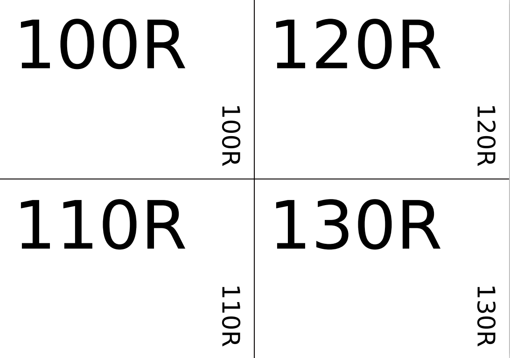

# Label editor for resistors
> A simple and fast label editor for individual bagged resistors.    

I have recently started to store my resistors in individual bags. To label these bags I have made this python script which produces my labels.

- [Typical File](assets/simple_demo.pdf) 

#### License

- MIT
